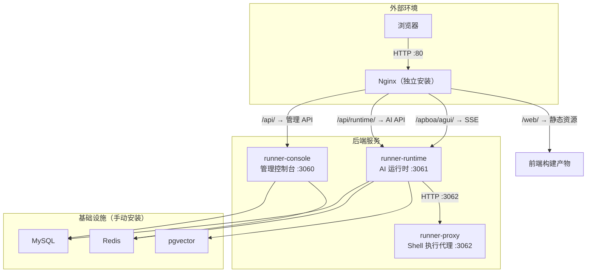
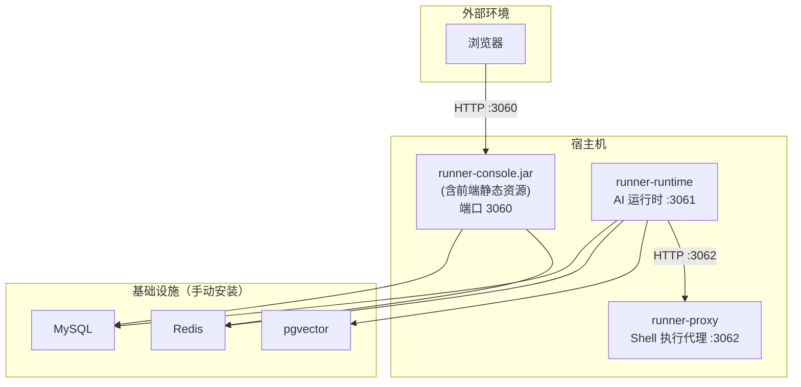
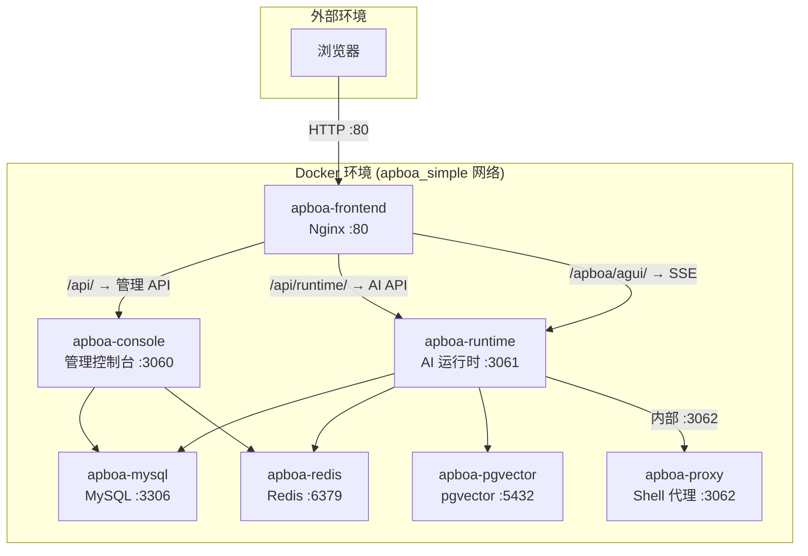
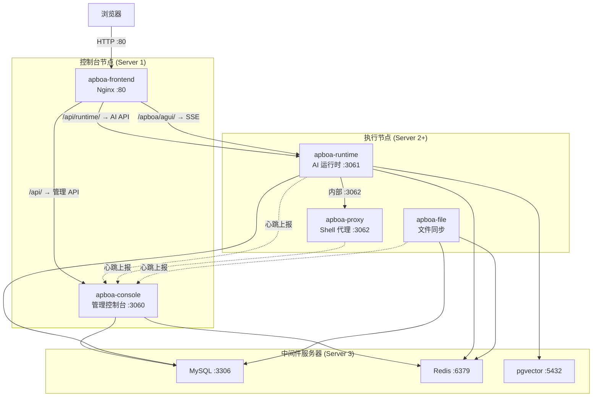

# 打包构建与部署

本文档介绍 Apboa Next 智能体平台的四种部署方案，从开发环境到生产环境的完整指南。


## 一、环境要求

### 后端环境

| 依赖 | 版本要求 | 说明 |
|------|----------|------|
| **JDK** | 21+ | Java 运行与编译环境 |
| **Maven** | 3.8+ | Java 项目构建工具 |

### 中间件环境

| 依赖 | 版本要求 | 说明 |
|------|----------|------|
| **MySQL** | 8.0+ | 关系型数据库 |
| **Redis** | 6.0+ | 缓存与消息中间件 |
| **pgvector** | pg16 | 向量存储（RAG 功能依赖） |

### 前端环境

| 依赖 | 版本要求 | 说明 |
|------|----------|------|
| **Node.js** | ^20.19.0 或 >=22.12.0 | JavaScript 运行环境 |
| **pnpm** | 最新版 | 包管理器（项目使用 pnpm） |

### Docker 环境（方案三 / 四）

| 依赖 | 版本要求 | 说明 |
|------|----------|------|
| **Docker** | >= 20.10 | 容器引擎 |
| **Docker Compose** | >= 2.0 | 容器编排 |


## 二、数据库初始化

:::info 前提条件
确保 MySQL 服务已启动。
:::

```sql
-- 创建数据库（如尚未创建）
CREATE DATABASE IF NOT EXISTS `apboa_next` DEFAULT CHARACTER SET utf8mb4 COLLATE utf8mb4_unicode_ci;
```

执行项目 `sql/once_db_init/` 下的初始化脚本：

```bash
mysql -u root -p apboa_next < sql/once_db_init/db_init.sql
```

:::warning 提醒
db_init.sql 已包含建库语句和全量表结构及初始数据，一条命令即可完成初始化。
:::


## 三、部署方案对比

| 方案 | 适用场景 | 复杂度 | 依赖项 |
|------|---------|--------|--------|
| 方案一：前后端分离 | 传统部署，灵活可控 | 中等 | 自行安装中间件 |
| 方案二：一体化 JAR | 单机快速部署 | 低 | 自行安装中间件 |
| 方案三：Docker 单机体验版 | 一键体验，快速上手 | 低 | Docker |
| 方案四：Docker 生产多服务器 | 生产环境，多节点扩展 | 较高 | Docker |


## 四、方案一：前后端分离部署

手动构建前后端，分别部署到服务器。前端通过 Nginx 托管，API 请求反向代理到后端。

### 4.1 构建后端

项目包含 4 个后端服务，按需构建：

```bash
# 管理控制台（必须，端口 3060）
mvn clean package -DskipTests -pl runner-console -am

# AI 运行时（必须，端口 3061）
mvn clean package -DskipTests -pl runner-runtime -am

# Shell 执行代理（必须，端口 3062）
mvn clean package -DskipTests -pl runner-proxy -am

# 文件同步服务（可选，仅多服务器部署时需要）
mvn clean package -DskipTests -pl runner-file -am
```

构建产物：

| 服务 | JAR 路径 |
|------|---------|
| console | `runner-console/target/runner-console-1.0-SNAPSHOT.jar` |
| runtime | `runner-runtime/target/runner-runtime-1.0-SNAPSHOT.jar` |
| proxy | `runner-proxy/target/runner-proxy-1.0-SNAPSHOT.jar` |
| file | `runner-file/target/runner-file-1.0-SNAPSHOT.jar` |

启动各服务：

```bash
java -jar runner-console/target/runner-console-1.0-SNAPSHOT.jar --spring.profiles.active=prod
java -jar runner-runtime/target/runner-runtime-1.0-SNAPSHOT.jar --spring.profiles.active=prod
java -jar runner-proxy/target/runner-proxy-1.0-SNAPSHOT.jar --spring.profiles.active=prod
java -jar runner-file/target/runner-file-1.0-SNAPSHOT.jar --spring.profiles.active=prod
```

### 4.2 构建前端

```bash
cd ui
pnpm install
```

生产构建：

| 构建命令 | 说明 | 产物目录 |
|----------|------|--------|
| `pnpm build:main` | 构建主应用 | `dist-main/` |
| `pnpm build:doc` | 构建文档子应用 | `dist-doc/` |
| `pnpm build` | 构建主应用 + 文档子应用（默认模式） | `dist/` |

### 4.3 Nginx 部署配置

将前端构建产物上传到服务器，参考以下 Nginx 配置：

```nginx
server {
    listen 80;
    server_name your-domain.com;

    client_max_body_size 100m;
    charset utf-8;

    # Gzip 压缩
    gzip on;
    gzip_min_length 1k;
    gzip_comp_level 6;
    gzip_types text/plain text/css text/javascript application/javascript application/json image/svg+xml;
    gzip_vary on;

    # ==================== 前端静态资源 ====================
    # 主应用
    location /web/ {
        alias /path/to/dist-main/;
        index index.html;
        try_files $uri $uri/ /web/index.html;
    }

    # 文档子应用
    location /web/doc/ {
        alias /path/to/dist-doc/;
        index doc.html;
        try_files $uri $uri/ /web/doc/doc.html;
    }

    # 根路径重定向
    location = / {
        return 301 /web/;
    }

    # ==================== API 代理 ====================
    # runtime API：/api/runtime/ → runtime:3061（剥离 /api 前缀）
    # 必须放在 /api/ 之前，Nginx 按最长前缀匹配
    location /api/runtime/ {
        proxy_pass http://127.0.0.1:3061/apboa/;
        proxy_set_header Host $host;
        proxy_set_header X-Real-IP $remote_addr;
        proxy_set_header X-Forwarded-For $proxy_add_x_forwarded_for;
        proxy_set_header X-Forwarded-Proto $scheme;
        proxy_http_version 1.1;
        proxy_set_header Upgrade $http_upgrade;
        proxy_set_header Connection "upgrade";
        proxy_read_timeout 300s;
    }

    # console API：/api/ → console:3060（剥离 /api 前缀）
    location /api/ {
        proxy_pass http://127.0.0.1:3060/;
        proxy_set_header Host $host;
        proxy_set_header X-Real-IP $remote_addr;
        proxy_set_header X-Forwarded-For $proxy_add_x_forwarded_for;
        proxy_set_header X-Forwarded-Proto $scheme;
        proxy_http_version 1.1;
        proxy_set_header Upgrade $http_upgrade;
        proxy_set_header Connection "upgrade";
        proxy_read_timeout 300s;
    }

    # ==================== AgentScope AG-UI（SSE 长连接） ====================
    location /apboa/agui/ {
        proxy_pass http://127.0.0.1:3061/apboa/agui/;
        proxy_set_header Host $host;
        proxy_set_header X-Real-IP $remote_addr;
        proxy_set_header X-Forwarded-For $proxy_add_x_forwarded_for;
        proxy_http_version 1.1;
        proxy_set_header Upgrade $http_upgrade;
        proxy_set_header Connection "upgrade";
        proxy_read_timeout 3600s;
        proxy_send_timeout 3600s;
        proxy_buffering off;
    }
}
```

:::info 路径兼容说明
后端 `ApiPathRewriteFilter` 自动剥离 `/api/` 和 `/web/api/` 请求前缀。`/api/runtime/` 路由到 runtime:3061，其余 `/api/` 路由到 console:3060。
:::

### 4.4 服务架构




## 五、方案二：一体化 JAR 部署

将前端构建产物嵌入后端 JAR，通过 Spring Boot 内置 Tomcat 直接提供静态资源，减少部署组件。

### 5.1 启用 UI 模块

**步骤一**：在根 `pom.xml` 的 `<modules>` 中添加 `ui` 模块：

```xml
<modules>
    <!-- ... 其他模块 ... -->
    <module>ui</module>
</modules>
```

**步骤二**：在 `runner-console/pom.xml` 中添加 `ui` 依赖：

```xml
<dependency>
    <groupId>com.hxh.apboa.next</groupId>
    <artifactId>ui</artifactId>
</dependency>
```

### 5.2 构建

```bash
# 构建 runner-console（会自动触发前端 pnpm build）
mvn clean package -DskipTests -pl runner-console -am
```

构建产物：`runner-console/target/runner-console-1.0-SNAPSHOT.jar`（内含前端静态资源）。

### 5.3 启动

```bash
java -jar runner-console/target/runner-console-1.0-SNAPSHOT.jar
```

访问 `http://localhost:3060/web/` 即可打开系统。

:::warning 注意
- 一体化 JAR 仅包含 console 服务，runtime/proxy 仍需独立部署
- 前端资源每次打包都会重新构建，首次构建耗时较长
- 开发阶段建议使用方案一的前后端分离模式
:::

### 5.4 服务架构




## 六、方案三：Docker 单机体验版

一键启动所有服务 + 中间件，适用于快速体验平台功能，不推荐生产使用。

### 6.1 环境要求

确保已安装 Docker 和 Docker Compose。

### 6.2 配置

编辑 `docker/.env.simple`，按需修改密码等配置：

```bash
# 数据库密码（生产环境务必修改）
MYSQL_PASSWORD=root
REDIS_PASSWORD=redis
PG_PASSWORD=postgres

# JWT 密钥
JWT_SECRET=your_secret

# 前端端口
FRONTEND_PORT=80
```

### 6.3 启动

```bash
cd docker

# 使用管理脚本（推荐，自动检测宿主机信息）
bash start-simple.sh build       # 构建并启动
bash start-simple.sh status      # 查看状态
bash start-simple.sh stop        # 停止
bash start-simple.sh rebuild     # 完全重建
bash start-simple.sh down        # 停止并删除容器
```

管理脚本支持的操作：`build` | `rebuild` | `start` | `stop` | `restart` | `down` | `status`

### 6.4 访问

- 主应用：`http://localhost/web/`
- 默认管理员：`admin` / `Admin@123.com`

### 6.5 包含的服务（7 个容器）

| 服务 | 容器名 | 端口 | 说明 |
|------|--------|------|------|
| MySQL | apboa-mysql | 3306 | 关系型数据库 |
| Redis | apboa-redis | 6379 | 缓存中间件 |
| pgvector | apboa-pgvector | 5432 | 向量存储 |
| console | apboa-console | 3060 | 管理控制台 |
| runtime | apboa-runtime | 3061 | AI 运行时 |
| proxy | apboa-proxy | 3062 | Shell 执行代理 |
| frontend | apboa-frontend | 80 | Nginx 前端 |

**不包含** runner-file（单机模式无需文件同步）。

### 6.6 服务架构




## 七、方案四：Docker 生产多服务器部署

推荐至少使用 3 台服务器，按角色分为：中间件服务器、控制台节点、执行节点。

### 7.1 部署架构概览

```
┌─────────────────────────────────────────────────────────────────────┐
│                     控制台节点 (Server 1)                            │
│  runner-console (:3060)  +  frontend (Nginx :80)                   │
└─────────────────────────────────────────────────────────────────────┘
                        │                        ▲
              MySQL/Redis│                        │ 心跳上报
                        │                        │
┌─────────────────────────────────────────────────────────────────────┐
│                     执行节点 (Server 2+)                             │
│  runner-runtime (:3061) + runner-proxy (:3062) + runner-file       │
└─────────────────────────────────────────────────────────────────────┘
                        │
              MySQL/Redis/pgvector
                        │
┌─────────────────────────────────────────────────────────────────────┐
│                     中间件服务器 (Server 3)                          │
│  MySQL (:3306)  +  Redis (:6379)  +  pgvector (:5432)             │
└─────────────────────────────────────────────────────────────────────┘
```

### 7.2 步骤一：部署中间件（Server 3）

```bash
cd docker

# 使用管理脚本
bash start-middleware.sh build     # 拉取镜像并启动
bash start-middleware.sh status    # 查看状态
```

或手动启动：

```bash
cp .env.middleware .env
# 编辑 .env 修改数据库密码等配置
docker compose -f docker-compose-middleware.yml up -d
```

### 7.3 步骤二：部署控制台节点（Server 1）

```bash
cd docker

# 使用管理脚本（推荐）
bash start-console.sh build      # 构建并启动
bash start-console.sh status     # 查看状态
```

或手动启动：

```bash
cp .env.console .env
```

编辑 `.env`，确保以下配置正确：

```bash
# 指向中间件服务器 IP
MYSQL_HOST=192.168.1.3
REDIS_HOST=192.168.1.3

# 指向执行节点服务器 IP（Nginx upstream 使用）
RUNTIME_HOST=192.168.1.2
RUNTIME_PORT=3061

docker compose -f docker-compose-console.yml up -d --build
```

### 7.4 步骤三：部署执行节点（Server 2+）

```bash
cd docker

# 使用管理脚本（推荐，自动注入宿主机 IP 和 hostname）
bash start-execute.sh build      # 构建并启动
bash start-execute.sh status     # 查看状态
bash start-execute.sh rebuild    # 完全重建
bash start-execute.sh stop       # 停止
```

或手动启动：

```bash
cp .env.execute .env
```

编辑 `.env`：

```bash
# 指向中间件服务器 IP
MYSQL_HOST=192.168.1.3
REDIS_HOST=192.168.1.3
PG_HOST=192.168.1.3

# 指向控制台服务器 IP（心跳上报使用）
CONSOLE_HOST=192.168.1.1

docker compose -f docker-compose-execute.yml up -d --build
```

:::info 心跳标识自动注入
启动脚本 `start-execute.sh` 会自动检测宿主机 IP 和 hostname，注入 `APBOA_NODE_ID` / `APBOA_HOST_NAME` / `APBOA_HOST_IP` 环境变量。如需手动指定，可在执行前设置：

```bash
APBOA_NODE_ID=node-01 bash start-execute.sh build
```
:::

### 7.5 水平扩展

每个执行节点必须使用唯一的 `NODE_ID`（启动脚本默认使用宿主机 IP，天然唯一）。

添加新的执行节点只需在新服务器上重复步骤三，脚本会自动注入该服务器的 IP 作为节点标识。

### 7.6 服务架构




## 八、常见问题

### Maven 构建失败？

1. 检查 JDK 版本是否为 21+
2. 检查 Maven 版本是否为 3.8+
3. 执行 `mvn clean` 清理缓存后重试
4. 检查网络是否能访问 Maven 仓库

### 前端 pnpm install 失败？

1. 检查 Node.js 版本是否符合 `^20.19.0 || >=22.12.0`
2. 清除缓存：`pnpm store prune`
3. 删除 `node_modules` 后重新安装

### 前端构建后页面空白？

1. 检查 Nginx `try_files` 是否指向正确的 HTML 入口
2. 检查 `VITE_APP_BASE_API` 和 Nginx 代理路径是否匹配
3. 确认 `/api/runtime/` 路由规则在 `/api/` 之前（Nginx 最长前缀匹配）

### 后端启动报数据库连接失败？

1. 确认 MySQL 服务已启动
2. 确认 `apboa_next` 数据库已通过 `db_init.sql` 初始化
3. 确认配置文件中的数据库连接信息正确
4. 确认 MySQL 用户有 `apboa_next` 库的读写权限

### Docker 构建镜像时下载依赖失败？

1. 在线环境：检查 `DOCKER_REGISTRY` 是否留空（默认 Docker Hub）
2. 离线环境：编辑 `docker/maven/settings.xml` 和 `docker/npm/.npmrc` 配置私有仓库
